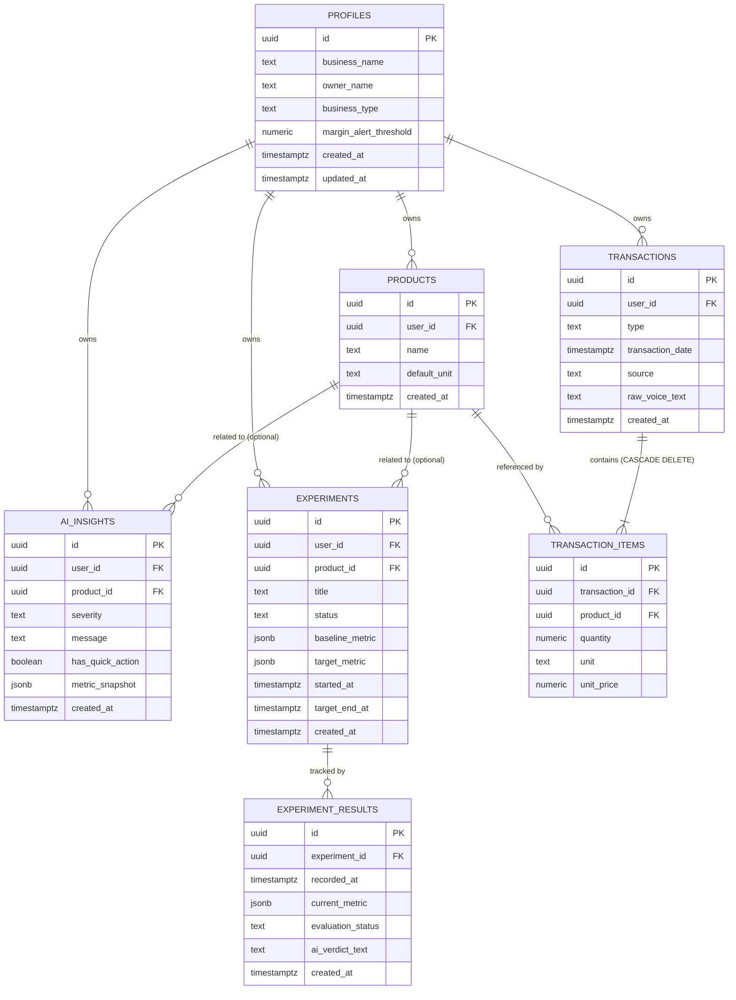
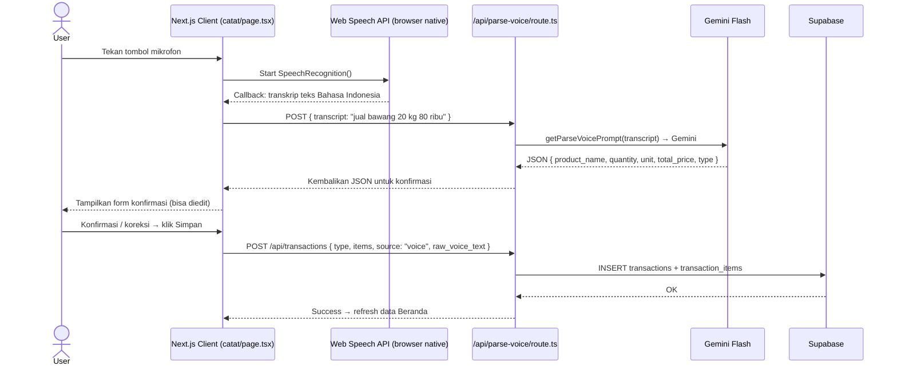
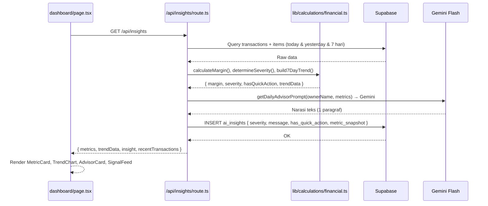
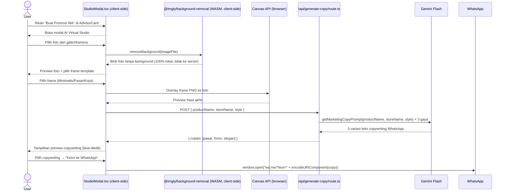

# TECHNICAL_SPEC.md — VokaSync

Dokumen rancangan teknis aktual VokaSync. Menjelaskan **bagaimana** sistem dibangun — struktur folder nyata, data model, API routes, kalkulasi, dan arsitektur responsif — sesuai kondisi kode yang sudah ter-build sukses.

> **STATUS**: ✅ `npm run build` sukses — 17 routes, 0 TypeScript error.

---

## 1. Tech Stack Aktual

| Komponen | Teknologi | Versi | Peran |
|---|---|---|---|
| Framework | Next.js App Router | `16.3.4` | SSR + API Routes. API key tidak bocor ke client. |
| Runtime | React | `19.2.8` | UI client-side. |
| TypeScript | TypeScript | `^5` | Tipe data seluruh entitas di `types/index.ts`. |
| Styling | Tailwind CSS v4 | `^4` | Layout responsive. Design tokens di `app/globals.css`. |
| Chart | Recharts | `^3.10.1` | BarChart tren 7 hari di `TrendChart.tsx`. |
| Icon | lucide-react | `^1.42.0` | Ikon konsisten di seluruh UI. |
| Database | Supabase PostgreSQL | `@supabase/supabase-js ^2.115.0` | Menyimpan semua data transaksi, produk, insight, eksperimen, profil. |
| Auth | Supabase Auth | (bundled) | Mengelola sesi login, isolasi data antar pengguna. |
| Supabase SSR | `@supabase/ssr` | `^0.12.6` | Helper browser client & server client di `lib/supabase/`. |
| AI — Voice Parsing | Google Gemini Flash | Free Tier | Parsing transkrip → JSON di `/api/parse-voice`. Prompt di `lib/ai/prompts.ts`. |
| AI — Insight | Google Gemini Flash | Free Tier | Narasi AI Advisor di `/api/insights`. |
| AI — Copywriting | Google Gemini Flash | Free Tier | Teks promosi WhatsApp di `/api/generate-copy`. |
| AI — Verdict | Google Gemini Flash | Free Tier | Evaluasi eksperimen di `/api/experiments` PATCH. |
| Voice Recognition | Web Speech API | Native browser | Transkripsi ucapan di browser, gratis, tanpa upload audio. |
| Background Removal | `@imgly/background-removal` | `^1.7.0` | 100% client-side di `StudioModal.tsx` — gambar tidak pernah ke server. |
| WhatsApp | URL Scheme `wa.me` | — | WhatsApp Direct tanpa API berbayar. |
| Deployment | Vercel | — | CD otomatis dari GitHub. |

> ⚠️ **PENTING untuk AI coding agent**: Next.js versi ini (`16.3.4`) menggunakan App Router. Selalu baca `node_modules/next/dist/docs/` sebelum menulis kode. Lihat `AGENTS.md` di root project.

---

## 2. Arsitektur Responsif

### Breakpoint

| Breakpoint | Ukuran Layar | Navigasi | File |
|---|---|---|---|
| Mobile | ≤767px | Bottom nav 4 tab (Beranda, Catat, Produk, Eksperimen) | `components/layout/bottom-nav.tsx` |
| Tablet | 768px–1023px | Sidebar kiri 64px icon-only | `components/layout/sidebar.tsx` |
| Desktop | ≥1024px | Sidebar kiri 240px ikon + label teks | `components/layout/sidebar.tsx` |

### Shell Global — `components/layout/app-shell.tsx`

Membungkus semua halaman di `app/layout.tsx`. Menentukan mana yang tampil:
- `<Sidebar />` — hanya desktop & tablet (hidden mobile)
- `<Header />` — adaptif per breakpoint
- `<BottomNav />` — hanya mobile (hidden desktop & tablet)

### Sidebar Desktop — `components/layout/sidebar.tsx`

- Background putih, border kanan tipis abu (`--border`).
- Logo VokaSync di atas.
- Menu items: Beranda (`/dashboard`), Catat (`/catat`), Produk (`/produk`), Eksperimen (`/eksperimen`), Riwayat (`/riwayat`), Settings (`/settings`).
- Menu aktif: background `--primary-light`, teks & ikon `--primary`.
- Ikon Logout di bagian paling bawah.
- Lebar: 240px (desktop), 64px (tablet icon-only via Tailwind responsive class).

### Header — `components/layout/header.tsx`

- **Desktop**: sapaan "Selamat datang, [nama]" + date picker + tombol "+ Catat Transaksi".
- **Mobile**: "VokaSync" di kiri + ikon notifikasi + ikon riwayat + ikon settings di kanan.

### Bottom Nav — `components/layout/bottom-nav.tsx`

- Fixed bottom, 4 tab: Beranda, Catat, Produk, Eksperimen.
- Tab aktif: ikon + teks hijau; tab non-aktif: abu.

---

## 3. Struktur Folder Aktual

```
SIMULASI-ANTIGRAVITY/
├── app/
│   ├── (auth)/
│   │   └── login/                    # Halaman login Supabase Auth
│   ├── api/
│   │   ├── experiments/
│   │   │   └── route.ts              # GET, POST, PATCH eksperimen
│   │   ├── generate-copy/
│   │   │   └── route.ts              # POST → Gemini → 3 variasi copywriting WA
│   │   ├── insights/
│   │   │   └── route.ts              # GET → hitung metrik + narasi Gemini + simpan ai_insights
│   │   ├── parse-voice/
│   │   │   └── route.ts              # POST → Gemini → JSON transaksi terstruktur
│   │   ├── product-analysis/
│   │   │   └── route.ts              # GET → margin & kategori aksi per produk
│   │   ├── settings/
│   │   │   └── route.ts              # GET & PATCH profil + margin_alert_threshold
│   │   └── transactions/
│   │       ├── route.ts              # GET (list+filter) & POST (simpan baru)
│   │       └── [id]/
│   │           └── route.ts          # PATCH (koreksi) & DELETE (hapus, cascade ke items)
│   ├── catat/
│   │   └── page.tsx                  # Halaman Catat Transaksi (voice + manual)
│   ├── dashboard/
│   │   └── page.tsx                  # Halaman Beranda/Dashboard
│   ├── eksperimen/
│   │   └── page.tsx                  # Halaman Eksperimen & Tracking
│   ├── produk/
│   │   └── page.tsx                  # Halaman Analisis Produk
│   ├── riwayat/
│   │   └── page.tsx                  # Halaman Riwayat Transaksi
│   ├── settings/
│   │   └── page.tsx                  # Halaman Settings & Profil
│   ├── globals.css                   # Design tokens (CSS custom properties)
│   ├── layout.tsx                    # Root layout — mount AppShell
│   └── page.tsx                      # Redirect ke /dashboard
│
├── components/
│   ├── dashboard/
│   │   ├── AdvisorCard.tsx           # Kartu AI Advisor + tombol Quick-Action
│   │   ├── MetricCard.tsx            # Kartu metrik angka besar + badge % perubahan
│   │   ├── RecentTransactions.tsx    # Tabel transaksi terbaru
│   │   ├── SignalFeed.tsx            # Feed kronologis sinyal ai_insights
│   │   └── TrendChart.tsx            # BarChart Recharts tren 7 hari
│   ├── layout/
│   │   ├── app-shell.tsx             # Shell pembungkus navigasi global
│   │   ├── bottom-nav.tsx            # Bottom navigation mobile
│   │   ├── header.tsx                # Header adaptif desktop & mobile
│   │   └── sidebar.tsx               # Sidebar desktop & tablet
│   └── studio/
│       └── StudioModal.tsx           # Modal AI Virtual Studio (all-in-one)
│
├── lib/
│   ├── ai/
│   │   ├── gemini.ts                 # Inisialisasi Gemini SDK, helper generateContent()
│   │   └── prompts.ts                # Template prompt: parseVoice, dailyAdvisor,
│   │                                 # experimentVerdict, marketingCopy
│   ├── calculations/
│   │   └── financial.ts              # calculateMargin(), determineActionCategory(),
│   │                                 # determineSeverity(), build7DayTrend()
│   ├── mock-data/
│   │   └── index.ts                  # Data statis fallback (tidak dipakai di production)
│   └── supabase/
│       ├── client.ts                 # createBrowserClient() untuk komponen client-side
│       └── server.ts                 # createServerClient() + createAdminClient() untuk API routes
│
├── supabase/
│   └── schema/
│       ├── 01_profiles.sql
│       ├── 02_products.sql
│       ├── 03_transactions.sql
│       ├── 04_transaction_items.sql
│       ├── 05_ai_insights.sql
│       ├── 06_experiments.sql
│       ├── 07_experiment_results.sql
│       ├── full_schema.sql           # Schema lengkap (gabungan 01–07 + RLS)
│       └── seed_data.sql             # Data demo Pak Budi untuk keperluan presentasi
│
├── types/
│   └── index.ts                      # Seluruh TypeScript interface & type
│
├── public/
│   └── frames/                       # Aset PNG frame AI Virtual Studio
│       ├── frame-minimalis.png
│       ├── frame-pasar.png
│       └── frame-kriya.png
│
├── .env.local                        # API keys (tidak di-commit, ada di .gitignore)
├── .env.example                      # Template env untuk onboarding anggota baru
├── next.config.ts
├── package.json
├── tsconfig.json
└── AGENTS.md                         # Instruksi khusus untuk AI coding agent
```

---

## 4. Design Tokens — `app/globals.css`

```css
:root {
  --background: #f5f5f5;       /* Background halaman — abu sangat terang */
  --foreground: #1e293b;       /* Teks utama */
  --card: #ffffff;              /* Background kartu */
  --card-foreground: #1e293b;
  --primary: #1a7a4a;           /* Warna aksen hijau utama */
  --primary-foreground: #ffffff;
  --primary-light: #eaf6ee;    /* Badge aktif, highlight positif */
  --primary-dark: #125734;
  --muted: #64748b;             /* Teks label sekunder */
  --muted-light: #f1f5f9;
  --border: #e2e8f0;            /* Garis border kartu */
}
```

---

## 5. TypeScript Types — `types/index.ts`

Semua entitas diketik ketat. Berikut ringkasannya:

```typescript
// Profil pengguna
interface Profile {
  id: string;
  business_name: string;
  owner_name: string;                      // Untuk sapaan di Beranda
  business_type: 'pasar'|'kuliner'|'kriya'|'kelontong'|'lainnya';
  margin_alert_threshold: number;          // Default 20 (%)
}

// Transaksi header
interface Transaction {
  id: string;
  user_id: string;
  type: 'expense' | 'income';
  transaction_date: string;
  source: 'voice' | 'manual';
  raw_voice_text?: string | null;
  items: TransactionItem[];
  total_amount?: number;                   // Computed, bukan disimpan
}

// Item rincian per produk dalam transaksi
interface TransactionItem {
  id: string;
  transaction_id: string;
  product_id: string;
  product_name?: string;                   // Join dari products
  quantity: number;
  unit: string;
  unit_price: number;                      // SATU-SATUNYA sumber harga
  subtotal?: number;                       // Computed (quantity × unit_price)
}

// Insight AI
interface AIInsight {
  id: string;
  user_id: string;
  severity: 'red' | 'yellow' | 'green';  // Ditentukan server, bukan AI
  message: string;                         // Narasi dari Gemini
  has_quick_action: boolean;               // true jika severity = 'red'
  metric_snapshot?: object;               // Angka saat insight dibuat (historis)
  created_at: string;
}

// Eksperimen bisnis
interface Experiment {
  id: string;
  status: 'running' | 'completed';
  baseline_metric: ExperimentMetric;      // Snapshot permanen
  target_metric?: ExperimentMetric | null;
  results?: ExperimentResult[];
}

// Hasil kalkulasi per produk untuk Analisis Produk
interface ProductAnalysisItem {
  id: string;
  name: string;
  cost_price: number;
  selling_price: number;
  margin_percentage: number;
  action_category: 'dorong'|'pertahankan'|'perbaiki'|'kurangi';
  avg_daily_volume: number;
  total_revenue_7d: number;
}

// Metrik harian untuk Dashboard
interface DashboardMetrics {
  today_income: number;
  today_income_change: number;    // % vs kemarin
  today_expense: number;
  today_expense_change: number;
  today_profit: number;
  today_profit_change: number;
  today_margin: number;
  today_margin_change: number;
}

// Data satu hari untuk chart tren
interface TrendDayData {
  date: string;
  dayName: string;                // 'Sen', 'Sel', dst.
  income: number;
  expense: number;
}
```

---

## 6. Database & Data Model

### Prinsip Desain

- **Sumber kebenaran tunggal**: angka keuangan hanya di `transaction_items.unit_price` — tidak diduplikasi.
- **Tidak menyimpan yang bisa dihitung ulang**: total harian, margin, kategori aksi — semua dihitung on-the-fly.
- **Snapshot hanya untuk kebutuhan historis**: `baseline_metric` di eksperimen disimpan permanen karena merepresentasikan kondisi pada satu titik waktu.
- **AI tidak pernah menjadi sumber angka**: tabel AI hanya menyimpan narasi teks.
- **RLS wajib** pada semua tabel dengan `user_id`.

---

### 6.1 `profiles`

| Kolom | Tipe | Keterangan |
|---|---|---|
| `id` | UUID (PK, FK → `auth.users.id`) | Satu-ke-satu dengan Supabase Auth. |
| `business_name` | text | Nama toko/usaha. |
| `owner_name` | text | Nama pemilik — dipakai untuk sapaan personal di Beranda. |
| `business_type` | text (nullable) | `pasar` / `kuliner` / `kriya` / `kelontong` / `lainnya`. |
| `margin_alert_threshold` | numeric | Ambang batas margin (%) pemicu peringatan. Default: 20. |
| `created_at` | timestamptz | — |
| `updated_at` | timestamptz | Diupdate setiap PATCH `/api/settings`. |

RLS: pengguna hanya baca/tulis baris miliknya (`id = auth.uid()`).

---

### 6.2 `products`

Master nama produk/bahan baku milik pengguna.

| Kolom | Tipe | Keterangan |
|---|---|---|
| `id` | UUID (PK) | — |
| `user_id` | UUID (FK → `profiles.id`) | Pemilik. |
| `name` | text | Nama produk/bahan baku. |
| `default_unit` | text | Satuan default (kg, pcs, ikat) — nilai bantu form autocomplete. |
| `created_at` | timestamptz | — |

Tidak disimpan di sini: harga beli, harga jual, margin — semua dihitung dari `transaction_items`.

---

### 6.3 `transactions`

Header satu kejadian transaksi (satu kali input voice/manual).

| Kolom | Tipe | Keterangan |
|---|---|---|
| `id` | UUID (PK) | — |
| `user_id` | UUID (FK → `profiles.id`) | Pemilik. |
| `type` | text | `expense` (pengeluaran/kulakan) atau `income` (pemasukan/penjualan). |
| `transaction_date` | timestamptz | Waktu transaksi terjadi. |
| `source` | text | `voice` atau `manual`. |
| `raw_voice_text` | text (nullable) | Transkrip mentah dari Web Speech API (untuk audit). |
| `created_at` | timestamptz | — |

Tidak disimpan: total nominal — dihitung dari SUM `transaction_items`.

---

### 6.4 `transaction_items`

Rincian per produk dalam satu transaksi.

| Kolom | Tipe | Keterangan |
|---|---|---|
| `id` | UUID (PK) | — |
| `transaction_id` | UUID (FK → `transactions.id`, CASCADE DELETE) | Transaksi induk. |
| `product_id` | UUID (FK → `products.id`) | Produk terkait. |
| `quantity` | numeric | Jumlah (mis. 20). |
| `unit` | text | Satuan pada transaksi ini (mis. kg). |
| `unit_price` | numeric | Harga per satuan — **satu-satunya sumber kebenaran harga**. |

`subtotal` = `quantity × unit_price` — tidak disimpan, dihitung saat query.

> CASCADE DELETE: hapus `transactions` → otomatis hapus semua `transaction_items` terkait.

---

### 6.5 Harga Modal & Harga Jual (Tanpa Tabel Terpisah)

Tidak ada tabel harga terpisah. Harga diturunkan dari `transaction_items` pada periode 7 hari terakhir:

- **Harga modal terkini** = `unit_price` dari `transaction_items` dengan `transactions.type = 'expense'` terbaru untuk produk tersebut.
- **Harga jual terkini** = `unit_price` dari `transaction_items` dengan `transactions.type = 'income'` terbaru untuk produk tersebut.
- **Margin** = `(harga_jual − harga_modal) / harga_jual × 100%` — dihitung di `lib/calculations/financial.ts`.

---

### 6.6 `ai_insights`

Riwayat narasi insight dari AI Advisor.

| Kolom | Tipe | Keterangan |
|---|---|---|
| `id` | UUID (PK) | — |
| `user_id` | UUID (FK → `profiles.id`) | Pemilik. |
| `product_id` | UUID (FK → `products.id`, nullable) | Produk terkait jika insight spesifik produk. |
| `severity` | text | `red` / `yellow` / `green` — **ditentukan deterministik oleh server**, bukan AI. |
| `message` | text | Narasi dari Gemini (bahasa awam + root-cause). |
| `has_quick_action` | boolean | `true` jika `severity = 'red'` — **ditentukan deterministik**, bukan AI. |
| `metric_snapshot` | jsonb | Angka-angka dasar narasi saat dibuat (bukan sumber kebenaran aktif). |
| `created_at` | timestamptz | Untuk label waktu relatif di SignalFeed. |

---

### 6.7 `experiments`

Tindakan yang direkomendasikan AI dan ditandai pengguna sebagai "dijalankan".

| Kolom | Tipe | Keterangan |
|---|---|---|
| `id` | UUID (PK) | — |
| `user_id` | UUID (FK → `profiles.id`) | Pemilik. |
| `product_id` | UUID (FK → `products.id`, nullable) | Produk fokus eksperimen. |
| `title` | text | Judul tindakan (mis. "Naikkan harga bawang Rp1.000/kg"). |
| `status` | text | `running` atau `completed`. |
| `baseline_metric` | jsonb | Snapshot kondisi sebelum — disimpan permanen. Format: `{ margin, price, daily_volume, daily_profit }`. |
| `target_metric` | jsonb (nullable) | Target yang ingin dicapai. Format sama dengan baseline. |
| `started_at` | timestamptz | Waktu mulai dijalankan. |
| `target_end_at` | timestamptz (nullable) | Estimasi waktu evaluasi — untuk indikator "hari X/Y". |
| `created_at` | timestamptz | — |

---

### 6.8 `experiment_results`

Checkpoint dan hasil evaluasi eksperimen.

| Kolom | Tipe | Keterangan |
|---|---|---|
| `id` | UUID (PK) | — |
| `experiment_id` | UUID (FK → `experiments.id`) | Eksperimen induk. |
| `recorded_at` | timestamptz | Waktu checkpoint dicatat. |
| `current_metric` | jsonb | Nilai metrik pada checkpoint ini. Format sama dengan baseline. |
| `evaluation_status` | text (nullable) | `in_progress` / `success` / `partial` / `failed`. |
| `ai_verdict_text` | text (nullable) | Narasi evaluasi dari Gemini (hanya teks). |
| `created_at` | timestamptz | — |

---

### 6.9 Ringkasan Tabel

| Tabel | Sumber Kebenaran Untuk |
|---|---|
| `profiles` | Identitas, sapaan, ambang batas peringatan |
| `products` | Master nama produk |
| `transactions` | Header kejadian transaksi |
| `transaction_items` | **Semua angka keuangan** |
| `ai_insights` | Riwayat narasi AI (bukan angka) |
| `experiments` | Definisi tindakan + baseline |
| `experiment_results` | Checkpoint & evaluasi hasil |
| Harga modal/jual | ❌ Tidak ada tabel — diturunkan dari `transaction_items` |
| Ringkasan harian | ❌ Tidak ada tabel — dihitung on-the-fly |
| Sesi AI Virtual Studio | ❌ Tidak ada tabel — ephemeral di state client |

---

## 7. Relasi Antar Tabel (ERD)



---

## 8. Alur Sistem Utama

```mermaid
flowchart LR
  U[User] -->|Aksi di UI| FE[Next.js Client]
  FE -->|Request| SRV[Next.js API Routes]
  SRV -->|Query/simpan| DB[(Supabase PostgreSQL)]
  SRV -->|Teks saja, bukan gambar| AI[Gemini Flash\nparse-voice / insights / copy / verdict]
  AI -->|Narasi/JSON| SRV
  SRV -->|Response| FE
  FE -->|Tampilkan| U

  FE -->|Background removal lokal| BR[@imgly/background-removal]
  BR -->|Foto tanpa background| FE
  FE -->|wa.me URL scheme| WA[WhatsApp Direct]
```

---

## 9. Alur Voice Input — `app/catat/page.tsx`



---

## 10. Alur AI Advisor — `app/dashboard/page.tsx` + `/api/insights`



---

## 11. Alur AI Virtual Studio — `components/studio/StudioModal.tsx`



---

## 12. Logika Kalkulasi — `lib/calculations/financial.ts`

### `calculateMargin(costPrice, sellingPrice)`

```
margin = (sellingPrice - costPrice) / sellingPrice × 100
Jika sellingPrice = 0 → return 0
Jika costPrice = 0 → return 100 (murni pemasukan)
```

### `determineActionCategory(margin, threshold = 20)`

```
margin >= 35%       → 'dorong'       (badge hijau)
margin >= threshold → 'pertahankan'  (badge biru)
margin >= 10%       → 'perbaiki'     (badge kuning)
margin < 10%        → 'kurangi'      (badge merah)
```

### `determineSeverity(margin, threshold = 20)`

```
margin < threshold       → severity: 'red',    hasQuickAction: true
margin < threshold + 5   → severity: 'yellow', hasQuickAction: false
margin >= threshold + 5  → severity: 'green',  hasQuickAction: false
```

> `threshold` dibaca dari `profiles.margin_alert_threshold` milik pengguna.

### `build7DayTrend(transactionsWithItems)`

Membuat array 7 elemen (D-6 sampai D-0), lalu mengagregasi total income dan expense per hari berdasarkan `transaction_date`. Output langsung dikonsumsi oleh `TrendChart.tsx` (Recharts).

---

## 13. AI Prompts — `lib/ai/prompts.ts`

| Fungsi | Digunakan Di | Output |
|---|---|---|
| `getParseVoicePrompt(transcript)` | `/api/parse-voice` | JSON `{ product_name, quantity, unit, total_price, type }` |
| `getDailyAdvisorPrompt(ownerName, metrics)` | `/api/insights` | 1 paragraf narasi Bahasa Indonesia (3-4 kalimat) |
| `getExperimentVerdictPrompt(title, product, baseline, current, days)` | `/api/experiments` PATCH | 2-3 kalimat verdict evaluasi |
| `getMarketingCopyPrompt(productName, storeName, style)` | `/api/generate-copy` | Teks promosi WhatsApp (1 variasi per panggilan, dipanggil 3× untuk 3 gaya) |

**Gaya marketing copy**: `'pasar'` (hangat kekeluargaan) / `'fomo'` (promo kilat mendesak) / `'elegan'` (kualitas terpercaya).

---

## 14. API Routes Lengkap

| Route | Method | Auth | Fungsi |
|---|---|---|---|
| `/api/parse-voice` | POST | Server (GEMINI_API_KEY) | Terima `{ transcript }` → Gemini → JSON transaksi. |
| `/api/transactions` | GET | Supabase user session | List transaksi dengan filter `?date_from=&date_to=&type=&product_name=`. |
| `/api/transactions` | POST | Supabase user session | Simpan transaksi + items baru ke DB. |
| `/api/transactions/[id]` | PATCH | Supabase user session | Koreksi satu transaksi (update items). |
| `/api/transactions/[id]` | DELETE | Supabase user session | Hapus transaksi + cascade ke items. |
| `/api/insights` | GET | Supabase user session | Hitung metrik deterministik + narasi Gemini + INSERT `ai_insights`. |
| `/api/product-analysis` | GET | Supabase user session | Margin & kategori aksi per produk (7 hari terakhir). |
| `/api/experiments` | GET | Supabase user session | List semua eksperimen + `experiment_results` terbaru. |
| `/api/experiments` | POST | Supabase user session | Buat eksperimen baru + simpan `baseline_metric`. |
| `/api/experiments` | PATCH | Supabase user session + Gemini | Update status → buat `experiment_results` → narasi verdict Gemini. |
| `/api/generate-copy` | POST | Server (GEMINI_API_KEY) | `{ productName, storeName, style }` → Gemini → teks copywriting. Tidak disimpan ke DB. |
| `/api/settings` | GET | Supabase user session | Ambil profil pengguna dari `profiles`. |
| `/api/settings` | PATCH | Supabase user session | Update `profiles` (business_name, owner_name, business_type, margin_alert_threshold). |

---

## 15. Pemisahan Deterministik vs AI

### ✅ Deterministik — Kode Server (`lib/calculations/financial.ts`)

- Total pemasukan/pengeluaran harian.
- Keuntungan bersih dan margin.
- Margin per produk dan volume terjual.
- Kategori aksi produk (Dorong/Pertahankan/Perbaiki/Kurangi) — aturan if-else `determineActionCategory()`.
- `severity` insight (`red`/`yellow`/`green`) — fungsi `determineSeverity()`.
- `has_quick_action` — `true` hanya jika `severity = 'red'`.
- Data chart tren 7 hari — `build7DayTrend()`.
- Perbandingan `current_metric` vs `baseline_metric`/`target_metric` di eksperimen.

### 🤖 AI / Gemini — Hanya Narasi & Parsing

- Parsing transkrip suara → JSON transaksi (`/api/parse-voice`).
- Narasi insight berdasarkan angka yang sudah dihitung (`/api/insights`).
- Verdict evaluasi eksperimen dalam bahasa awam (`/api/experiments` PATCH).
- Copywriting promosi WhatsApp (`/api/generate-copy`).

### 🖥️ Non-AI Client-side

- Background removal foto (`@imgly/background-removal` WASM).
- Overlay frame studio ke foto (Canvas API browser).
- Voice recognition (`Web Speech API` browser native).

---

## 16. Supabase Client Helpers — `lib/supabase/`

### `client.ts` — Browser Client

```typescript
// Dipakai di komponen React client-side ('use client')
import { createBrowserClient } from '@supabase/ssr'
export const supabase = createBrowserClient(
  process.env.NEXT_PUBLIC_SUPABASE_URL!,
  process.env.NEXT_PUBLIC_SUPABASE_ANON_KEY!
)
```

### `server.ts` — Server Client (API Routes)

```typescript
// Untuk API routes — membaca session dari cookies
createServerClient(url, anonKey, { cookies })  // Regular user session

// Untuk operasi admin (bypass RLS jika diperlukan)
createClient(url, serviceRoleKey)               // Admin client
```

---

## 17. Aturan Keamanan

1. `GEMINI_API_KEY` **hanya di server** — tidak boleh ada di file dalam `components/` atau `app/` yang dirender client.
2. `SUPABASE_SERVICE_ROLE_KEY` **hanya di server** — tidak pernah diekspos ke bundle client.
3. RLS aktif pada semua tabel — setiap baris hanya dapat diakses oleh pemiliknya (`user_id = auth.uid()`).
4. Gambar pengguna **tidak pernah dikirim ke server** — background removal sepenuhnya client-side WASM.
5. `.env.local` wajib masuk `.gitignore` — tidak pernah di-commit ke GitHub.
6. Semua env production diatur di Vercel dashboard, bukan di file yang di-commit.
7. Gunakan `createServerClient` (dari `lib/supabase/server.ts`) di semua API routes — bukan `createBrowserClient`.

---

## 18. Environment Variables

### `.env.local` (lokal, tidak di-commit)

```env
NEXT_PUBLIC_SUPABASE_URL=https://xxxxx.supabase.co
NEXT_PUBLIC_SUPABASE_ANON_KEY=eyJhbGci...
SUPABASE_SERVICE_ROLE_KEY=eyJhbGci...
GEMINI_API_KEY=AIzaSy...
```

### Keterangan Scope

| Variable | Scope | Dipakai Di |
|---|---|---|
| `NEXT_PUBLIC_SUPABASE_URL` | Public (browser + server) | `lib/supabase/client.ts`, `lib/supabase/server.ts` |
| `NEXT_PUBLIC_SUPABASE_ANON_KEY` | Public (browser + server) | `lib/supabase/client.ts`, `lib/supabase/server.ts` |
| `SUPABASE_SERVICE_ROLE_KEY` | **Server only** | `lib/supabase/server.ts` (createAdminClient) |
| `GEMINI_API_KEY` | **Server only** | `lib/ai/gemini.ts` |

---

## 19. Setup Database Supabase

Jalankan file SQL berikut di Supabase SQL Editor secara berurutan:

```
1. supabase/schema/full_schema.sql   → Buat semua tabel + RLS policies
2. supabase/schema/seed_data.sql     → Insert data demo Pak Budi untuk presentasi
```

Atau jalankan per file secara berurutan:
```
01_profiles.sql → 02_products.sql → 03_transactions.sql →
04_transaction_items.sql → 05_ai_insights.sql →
06_experiments.sql → 07_experiment_results.sql
```

---

## 20. Deployment ke Vercel

1. Push repository ke GitHub.
2. Hubungkan ke project baru di Vercel dashboard.
3. Set environment variables di Vercel dashboard (Settings → Environment Variables):
   - `NEXT_PUBLIC_SUPABASE_URL`
   - `NEXT_PUBLIC_SUPABASE_ANON_KEY`
   - `SUPABASE_SERVICE_ROLE_KEY`
   - `GEMINI_API_KEY`
4. Push ke branch utama → Vercel build dan deploy otomatis.
5. Verifikasi Live URL dari perangkat mobile dan desktop.
6. Akun uji coba dengan seed data Pak Budi sudah siap untuk demo juri.

---

## 21. Development Lokal

```bash
# 1. Clone & install
npm install

# 2. Buat .env.local dari template
cp .env.example .env.local
# → isi 4 env variable

# 3. Jalankan database schema + seed
# (di Supabase SQL Editor: jalankan full_schema.sql lalu seed_data.sql)

# 4. Jalankan dev server
npm run dev
# → buka http://localhost:3000

# 5. Verifikasi production build
npm run build
# → harus sukses: 17 routes, 0 TypeScript error
```
