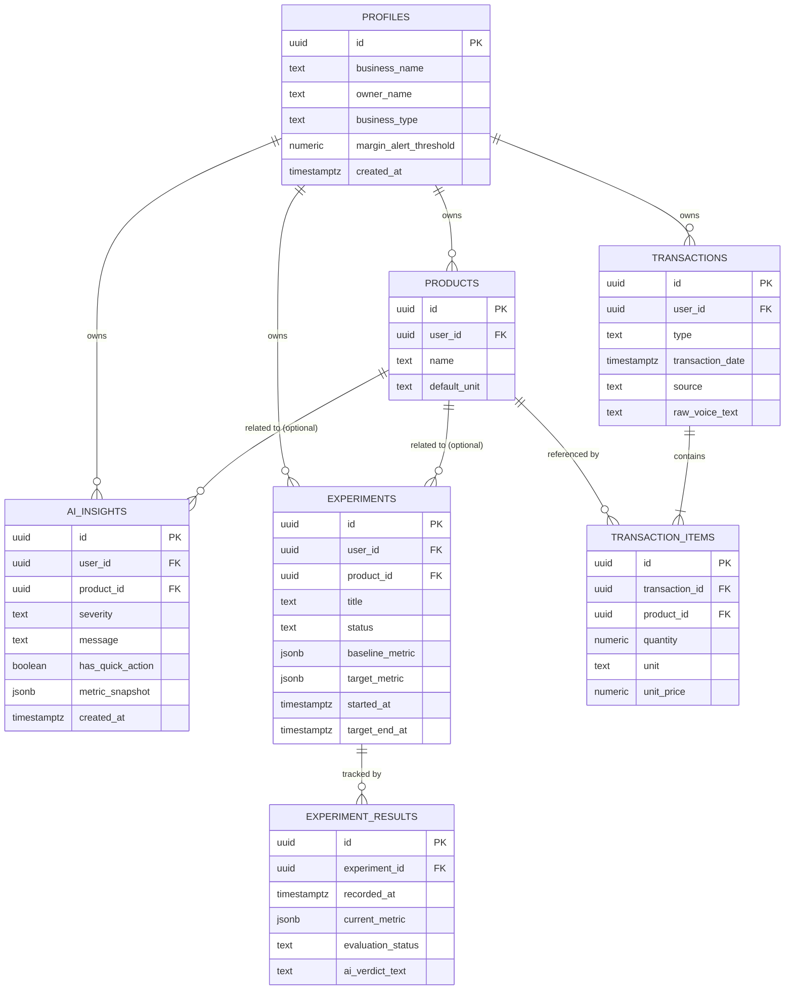
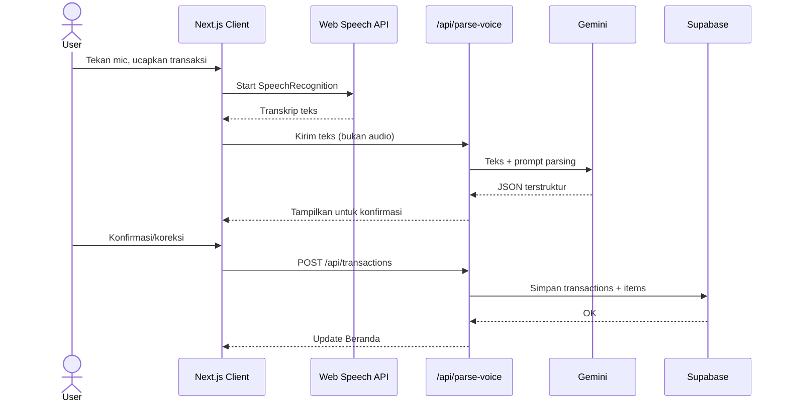
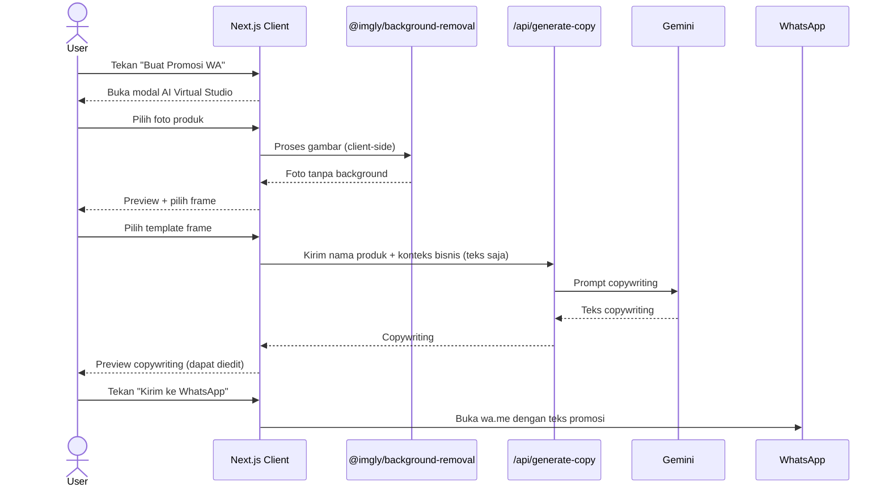

# TECHNICAL_SPEC.md — VokaSync

Dokumen rancangan teknis untuk implementasi VokaSync sesuai PRD.md.
Menjelaskan **bagaimana** sistem dibangun — struktur data, arsitektur, API, dan layout responsif — tanpa menulis kode program atau SQL DDL.

---

## 1. Tech Stack

| Komponen | Teknologi | Peran dalam VokaSync |
|---|---|---|
| Framework Fullstack | Next.js 14+ (App Router, TypeScript) | Merender UI semua halaman, menangani routing, dan menjadi API Route server agar API key tidak bocor ke client. |
| Styling | Tailwind CSS | Implementasi layout responsive: sidebar desktop, icon-only tablet, bottom nav mobile. Gaya visual mengacu Quixotic (light mode, hijau, kartu putih). |
| Chart | Recharts | Chart bar tren pemasukan vs pengeluaran 7 hari terakhir di Beranda. |
| Database | Supabase (PostgreSQL) | Menyimpan seluruh data transaksi, produk, insight, eksperimen, profil. |
| Auth | Supabase Auth | Mengelola sesi login dan memisahkan data antar akun. |
| Deployment | Vercel | Hosting, terhubung otomatis ke GitHub, environment variable aman. |
| AI — Voice Parsing | Google Gemini 3.6 Flash | Digunakan khusus di `app/api/parse-voice/route.ts` untuk parsing transkrip suara menjadi data transaksi terstruktur. Semua panggilan **wajib** lewat API Route server. |
| AI — Insight & Copywriting | Google Gemini 3.6 Flash (Free Tier) | Digunakan untuk narasi AI Advisor (`/api/insights`), verdict eksperimen (`/api/experiments`), dan copywriting promosi (`/api/generate-copy`). Semua panggilan **wajib** lewat API Route server. |
| Voice Recognition | Web Speech API (native browser) | Transkripsi ucapan di browser tanpa biaya API dan tanpa upload audio. |
| Background Removal | `@imgly/background-removal` (open-source) | Hapus background foto 100% client-side di perangkat pengguna — tidak ada gambar dikirim ke server. |
| WhatsApp Integration | URL Scheme `wa.me` | WhatsApp Direct tanpa WhatsApp Business API berbayar. |

**Komitmen Rp0:** Setiap komponen dipilih agar VokaSync beroperasi tanpa biaya langganan API berbayar bagi tim maupun pengguna.

---

## 2. Arsitektur Responsif

VokaSync menggunakan satu codebase Next.js dengan layout yang menyesuaikan ukuran layar.

### Breakpoint

| Breakpoint | Ukuran | Layout Navigasi |
|---|---|---|
| Mobile | ≤767px | Bottom navigation 4 tab (Beranda, Catat, Produk, Eksperimen). Riwayat & Settings diakses dari ikon header. |
| Tablet | 768px–1023px | Sidebar kiri icon-only (ikon tanpa label teks), dapat di-tap untuk expand. |
| Desktop | ≥1024px | Sidebar kiri full (ikon + label teks), fixed. |

### Sidebar Desktop (Mengacu Quixotic)

- Background putih, border kanan tipis abu.
- Logo VokaSync di atas.
- Menu items: Beranda, Catat, Produk, Eksperimen, Riwayat, Settings.
- Menu aktif: background hijau muda, teks & ikon hijau tua.
- Ikon Logout di bagian paling bawah.
- Lebar sidebar: 240px (desktop), 64px (tablet icon-only).

### Header Desktop

- Topbar di kanan sidebar: sapaan "Selamat datang, [nama]", date picker rentang tanggal, tombol "+ Catat Transaksi" hijau di kanan atas.

### Header Mobile

- Fixed top bar: nama app "VokaSync" di tengah/kiri, ikon notifikasi + ikon riwayat + ikon settings di kanan.

---

## 3. Struktur Folder Next.js

```
vokasync/
├─ app/
│  ├─ (auth)/
│  │  └─ login/page.tsx
│  ├─ dashboard/page.tsx              # Beranda
│  ├─ catat/page.tsx                  # Catat Transaksi
│  ├─ produk/page.tsx                 # Analisis Produk
│  ├─ eksperimen/page.tsx             # Eksperimen & Tracking
│  ├─ riwayat/page.tsx                # Riwayat Transaksi (BARU)
│  ├─ settings/page.tsx               # Settings / Profil (BARU)
│  ├─ api/
│  │  ├─ parse-voice/route.ts         # Terima transkrip → Gemini 3.6 Flash → JSON transaksi
│  │  ├─ transactions/route.ts        # GET (list+filter) & POST (simpan)
│  │  ├─ transactions/[id]/route.ts   # PATCH (koreksi) & DELETE (hapus) (BARU)
│  │  ├─ insights/route.ts            # Hitung metrik deterministik + narasi Gemini
│  │  ├─ product-analysis/route.ts    # Margin & kategori aksi per produk
│  │  ├─ experiments/route.ts         # GET, POST, PATCH eksperimen
│  │  ├─ generate-copy/route.ts       # Copywriting promosi via Gemini
│  │  └─ settings/route.ts            # GET & PATCH profil + ambang batas (BARU)
│  └─ layout.tsx                      # Layout global + komponen navigasi
├─ components/
│  ├─ layout/
│  │  ├─ sidebar.tsx                  # Sidebar desktop & tablet
│  │  ├─ bottom-nav.tsx               # Bottom nav mobile
│  │  └─ header.tsx                   # Header desktop & mobile
│  ├─ dashboard/
│  │  ├─ MetricCard.tsx               # Kartu metrik dengan angka besar + badge
│  │  ├─ TrendChart.tsx               # Chart bar tren 7 hari (Recharts)
│  │  └─ AdvisorCard.tsx              # Kartu AI Advisor + Quick-Action button
│  ├─ studio/
│  │  ├─ StudioModal.tsx              # Modal AI Virtual Studio
│  │  ├─ BackgroundRemover.tsx        # @imgly/background-removal client-side
│  │  ├─ FramePicker.tsx              # Pilihan template frame
│  │  └─ CopywritingEditor.tsx        # Preview & edit copywriting Gemini
│  └─ ui/                             # Komponen dasar (badge, progress bar, dsb.)
├─ lib/
│  ├─ supabase/
│  │  ├─ client.ts                    # Supabase client browser
│  │  └─ server.ts                    # Supabase client server (@supabase/ssr)
│  ├─ calculations/                   # Logika perhitungan deterministik
│  ├─ studio/frames.ts                # Daftar template frame studio
│  └─ ai/prompts.ts                   # Template prompt Gemini
├─ public/frames/                     # Aset PNG frame studio
│  ├─ frame-minimalis.png
│  ├─ frame-pasar.png
│  └─ frame-kriya.png
├─ types/index.ts                     # Tipe TypeScript semua entitas
└─ .env.local                         # API keys (tidak di-commit)
```

---

## 4. Database & Data Model

### Prinsip Desain

- **Sumber kebenaran tunggal**: angka keuangan hanya tersimpan di `transaction_items`, tidak diduplikasi di tempat lain.
- **Tidak menyimpan yang bisa dihitung ulang**: total harian, margin, kategori aksi — semua dihitung on-the-fly dari query agregasi.
- **Snapshot hanya untuk kebutuhan historis**: `baseline_metric` di eksperimen disimpan karena merepresentasikan kondisi pada satu titik waktu yang tidak bisa direkonstruksi ulang.
- **AI tidak pernah menjadi sumber angka**: tabel AI hanya menyimpan narasi teks, bukan angka keuangan.
- **RLS wajib** pada semua tabel dengan `user_id`.

---

### 4.1 `profiles`

Menyimpan data tambahan pemilik usaha, melengkapi `auth.users`.

| Kolom | Tipe | Keterangan |
|---|---|---|
| `id` | UUID (PK, FK → `auth.users.id`) | Identitas pengguna, satu-ke-satu dengan Auth. |
| `business_name` | text | Nama toko/usaha. |
| `owner_name` | text | Nama pemilik — dipakai untuk sapaan personal. |
| `business_type` | text (nullable) | Jenis usaha: `pasar`, `kuliner`, `kriya`, `kelontong`, `lainnya`. |
| `margin_alert_threshold` | numeric | **[BARU]** Ambang batas margin (%) yang memicu peringatan. Default: 20. Dapat diubah di Settings. |
| `created_at` | timestamptz | Waktu dibuat. |
| `updated_at` | timestamptz | Waktu terakhir diubah. |

RLS: pengguna hanya dapat baca/tulis baris miliknya (`id = auth.uid()`).

---

### 4.2 `products`

Master nama produk/bahan baku milik pengguna.

| Kolom | Tipe | Keterangan |
|---|---|---|
| `id` | UUID (PK) | Identitas unik produk. |
| `user_id` | UUID (FK → `profiles.id`) | Pemilik. |
| `name` | text | Nama produk/bahan baku. |
| `default_unit` | text | Satuan default (kg, pcs, ikat) — hanya nilai bantu form. |
| `created_at` | timestamptz | Waktu pertama kali dicatat. |

Tidak disimpan di sini: harga beli, harga jual, margin — semua dihitung dari `transaction_items`.

RLS: hanya pemilik yang dapat baca/tulis.

---

### 4.3 `transactions`

Header satu kejadian transaksi (satu kali input voice/manual).

| Kolom | Tipe | Keterangan |
|---|---|---|
| `id` | UUID (PK) | Identitas unik transaksi. |
| `user_id` | UUID (FK → `profiles.id`) | Pemilik. |
| `type` | text (`expense` \| `income`) | Jenis: pengeluaran atau pemasukan. |
| `transaction_date` | timestamptz | Tanggal/waktu transaksi terjadi. |
| `source` | text (`voice` \| `manual`) | Asal input. |
| `raw_voice_text` | text (nullable) | Transkrip mentah dari Web Speech API (untuk audit). |
| `created_at` | timestamptz | Waktu baris dibuat. |

Tidak disimpan: total nominal — dihitung dari jumlah `transaction_items` terkait.

RLS: hanya pemilik yang dapat baca/tulis.

---

### 4.4 `transaction_items`

Rincian per produk dalam satu transaksi.

| Kolom | Tipe | Keterangan |
|---|---|---|
| `id` | UUID (PK) | Identitas unik baris item. |
| `transaction_id` | UUID (FK → `transactions.id`) | Transaksi induk. |
| `product_id` | UUID (FK → `products.id`) | Produk terkait. |
| `quantity` | numeric | Jumlah (mis. 20). |
| `unit` | text | Satuan pada transaksi ini (mis. kg). |
| `unit_price` | numeric | Harga per satuan — **satu-satunya sumber kebenaran harga**. |

Tidak disimpan: `subtotal` (= `quantity × unit_price`) — dihitung saat query.

RLS: diwariskan dari `transactions` via relasi.

---

### 4.5 Harga Modal & Harga Jual (Tanpa Tabel Terpisah)

Tidak ada tabel harga terpisah. Harga diturunkan dari `transaction_items`:
- **Harga modal terkini** = `unit_price` dari `transaction_items` tipe `expense` terbaru untuk produk tersebut.
- **Harga jual terkini** = `unit_price` dari `transaction_items` tipe `income` terbaru untuk produk tersebut.
- **Margin** = (harga jual − harga modal) ÷ harga jual × 100%.

Periode agregasi default untuk MVP: transaksi 7 hari terakhir.

---

### 4.6 `ai_insights`

Riwayat narasi insight dari AI Advisor.

| Kolom | Tipe | Keterangan |
|---|---|---|
| `id` | UUID (PK) | Identitas unik insight. |
| `user_id` | UUID (FK → `profiles.id`) | Pemilik. |
| `product_id` | UUID (FK → `products.id`, nullable) | Produk terkait jika insight spesifik produk. |
| `severity` | text (`red` \| `yellow` \| `green`) | Level peringatan — **ditentukan deterministik oleh sistem** berdasarkan margin vs `profiles.margin_alert_threshold`. |
| `message` | text | Narasi insight dari Gemini (bahasa awam + root-cause). |
| `has_quick_action` | boolean | Tombol "Buat Promosi WA" tampil jika `true` — **ditentukan deterministik** (bukan oleh AI). |
| `metric_snapshot` | jsonb | Angka-angka dasar narasi saat dibuat (bukan sumber kebenaran aktif). |
| `created_at` | timestamptz | Waktu dibuat — untuk label waktu relatif di Sinyal terbaru. |

RLS: hanya pemilik yang dapat baca/tulis.

---

### 4.7 `experiments`

Tindakan yang direkomendasikan AI dan ditandai pengguna sebagai "dijalankan".

| Kolom | Tipe | Keterangan |
|---|---|---|
| `id` | UUID (PK) | Identitas unik eksperimen. |
| `user_id` | UUID (FK → `profiles.id`) | Pemilik. |
| `product_id` | UUID (FK → `products.id`, nullable) | Produk fokus eksperimen. |
| `title` | text | Judul tindakan (mis. "Naikkan harga bawang Rp1.000/kg"). |
| `status` | text (`running` \| `completed`) | Status saat ini. |
| `baseline_metric` | jsonb | Snapshot kondisi sebelum — disimpan permanen karena historis. |
| `target_metric` | jsonb (nullable) | Target yang ingin dicapai. |
| `started_at` | timestamptz | Waktu mulai dijalankan. |
| `target_end_at` | timestamptz (nullable) | Estimasi waktu evaluasi — untuk indikator "hari X/Y". |
| `created_at` | timestamptz | Waktu dibuat. |

RLS: hanya pemilik yang dapat baca/tulis.

---

### 4.8 `experiment_results`

Checkpoint dan hasil evaluasi eksperimen dari waktu ke waktu.

| Kolom | Tipe | Keterangan |
|---|---|---|
| `id` | UUID (PK) | Identitas unik baris. |
| `experiment_id` | UUID (FK → `experiments.id`) | Eksperimen induk. |
| `recorded_at` | timestamptz | Waktu checkpoint dicatat. |
| `current_metric` | jsonb | Nilai metrik pada checkpoint ini — snapshot historis. |
| `evaluation_status` | text (nullable) | `in_progress` \| `success` \| `partial` \| `failed` — diisi pada checkpoint final. |
| `ai_verdict_text` | text (nullable) | Narasi evaluasi dari Gemini (hanya teks, bukan sumber angka). |
| `created_at` | timestamptz | Waktu dibuat. |

RLS: diwariskan dari `experiments`.

---

### 4.9 Ringkasan Tabel

| Tabel | Wajib | Sumber Kebenaran Untuk |
|---|---|---|
| `profiles` | Wajib | Identitas, sapaan, ambang batas peringatan |
| `products` | Wajib | Master nama produk |
| `transactions` | Wajib | Header kejadian transaksi |
| `transaction_items` | Wajib | Semua angka keuangan |
| `ai_insights` | Wajib | Riwayat narasi AI (bukan angka) |
| `experiments` | Wajib | Definisi tindakan + baseline |
| `experiment_results` | Wajib | Checkpoint & evaluasi hasil |
| Harga modal/jual | Tidak ada tabel — diturunkan dari `transaction_items` | — |
| Ringkasan harian | Tidak ada tabel — dihitung on-the-fly | — |
| Sesi AI Virtual Studio | Tidak ada tabel — ephemeral di state client | — |

---

## 5. Relasi Antar Tabel (ERD)



---

## 6. Alur Sistem Utama

```mermaid
flowchart LR
  U[User] -->|Aksi di UI| FE[Next.js Client]
  FE -->|Request| SRV[Next.js API Routes]
  SRV -->|Query/simpan| DB[(Supabase PostgreSQL)]
  SRV -->|Teks saja, bukan gambar| AI[Gemini 3.6 Flash - parse-voice\nGemini 3.6 Flash - insight, copy]
  AI -->|Narasi/JSON| SRV
  SRV -->|Response| FE
  FE -->|Tampilkan| U

  FE -->|Background removal lokal| BR[@imgly/background-removal]
  BR -->|Foto tanpa background| FE
  FE -->|wa.me URL scheme| WA[WhatsApp Direct]
```

---

## 7. Alur Voice Input



---

## 8. Alur AI Virtual Studio



---

## 9. Pemisahan Deterministik vs AI

### Deterministik (kode server, query ke DB)
- Total pemasukan/pengeluaran harian.
- Keuntungan bersih dan margin.
- Margin per produk dan volume terjual.
- Kategori aksi produk (Dorong/Pertahankan/Perbaiki/Kurangi) — aturan if-else berbasis margin.
- `severity` insight (`red`/`yellow`/`green`) — dibandingkan dengan `profiles.margin_alert_threshold`.
- `has_quick_action` — `true` jika `severity = 'red'`.
- Data chart tren 7 hari — agregasi harian dari `transactions`/`transaction_items`.
- Perbandingan `current_metric` vs `baseline_metric`/`target_metric` di eksperimen.

### AI / Gemini (hanya narasi dan parsing)
- Parsing transkrip suara → JSON transaksi terstruktur (`/api/parse-voice`).
- Narasi insight/peringatan berdasarkan angka yang sudah dihitung (`/api/insights`).
- Narasi verdict evaluasi eksperimen (`/api/experiments` PATCH).
- Copywriting promosi AI Virtual Studio (`/api/generate-copy`).

### Non-AI Client-side
- Background removal foto produk (`@imgly/background-removal`).
- Overlay frame studio ke foto (Canvas API).

---

## 10. API Routes

| Route | Metode | Fungsi |
|---|---|---|
| `/api/parse-voice` | POST | Terima transkrip teks → **Gemini 3.6 Flash** → kembalikan JSON transaksi untuk konfirmasi. |
| `/api/transactions` | GET | Ambil daftar transaksi dengan filter (tanggal, jenis, produk) untuk halaman Riwayat. |
| `/api/transactions` | POST | Simpan transaksi + items baru. |
| `/api/transactions/[id]` | PATCH | Koreksi transaksi yang sudah ada. |
| `/api/transactions/[id]` | DELETE | Hapus transaksi (cascade ke items). |
| `/api/insights` | GET | Hitung metrik deterministik + panggil Gemini untuk narasi + simpan ke `ai_insights`. |
| `/api/product-analysis` | GET | Hitung margin & volume per produk + tentukan kategori aksi. |
| `/api/experiments` | GET | Ambil semua eksperimen + results terbaru. |
| `/api/experiments` | POST | Buat eksperimen baru (simpan baseline_metric). |
| `/api/experiments` | PATCH | Update status + tambah experiment_results + narasi Gemini. |
| `/api/generate-copy` | POST | Terima nama produk + konteks bisnis → Gemini → kembalikan copywriting (tidak disimpan ke DB). |
| `/api/settings` | GET | Ambil data profil pengguna. |
| `/api/settings` | PATCH | Simpan perubahan profil + `margin_alert_threshold`. |

---

## 11. Aturan Keamanan

1. `GEMINI_API_KEY` hanya di server — tidak boleh ada di file `components/` atau `app/` yang dirender client.
2. `SUPABASE_SERVICE_ROLE_KEY` hanya di server — tidak pernah diekspos ke client.
3. RLS aktif pada semua tabel — setiap baris hanya dapat diakses oleh pemiliknya (`user_id = auth.uid()`).
4. Gambar pengguna tidak pernah dikirim ke server — background removal sepenuhnya client-side.
5. `.env.local` wajib masuk `.gitignore` — tidak pernah di-commit ke GitHub.
6. Semua environment variable production diatur di Vercel dashboard, bukan di file yang di-commit.

---

## 12. Deployment ke Vercel

1. Push repository ke GitHub.
2. Hubungkan ke project baru di Vercel.
3. Set environment variables di Vercel dashboard:
   - `NEXT_PUBLIC_SUPABASE_URL`
   - `NEXT_PUBLIC_SUPABASE_ANON_KEY`
   - `SUPABASE_SERVICE_ROLE_KEY`
   - `GEMINI_API_KEY`
4. Push ke branch utama → Vercel build dan deploy otomatis.
5. Verifikasi Live URL dari perangkat mobile dan desktop.
6. Siapkan akun uji coba dengan data seed untuk kebutuhan demo juri.
