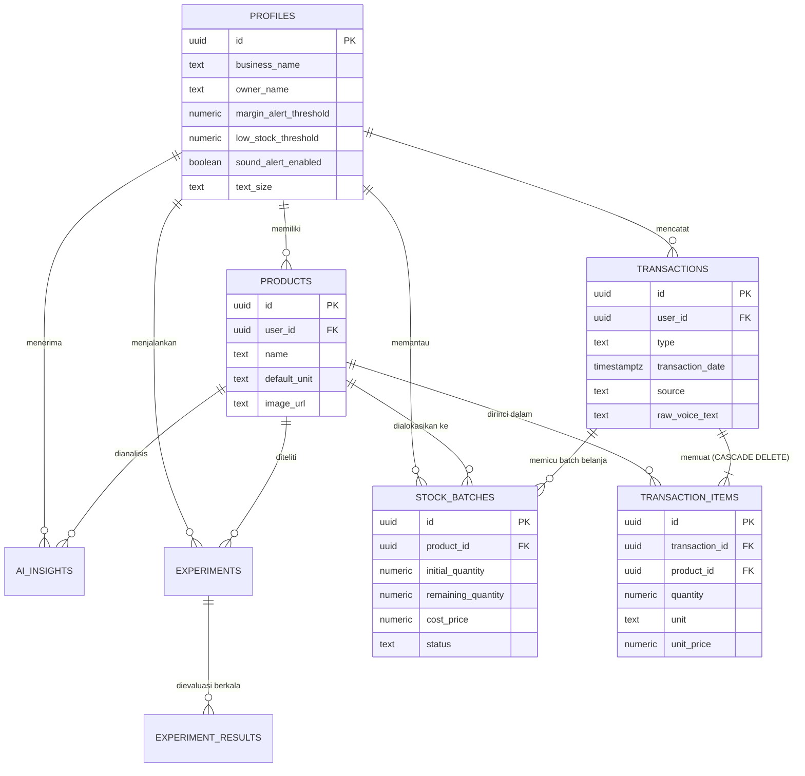
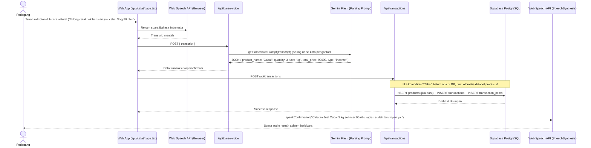
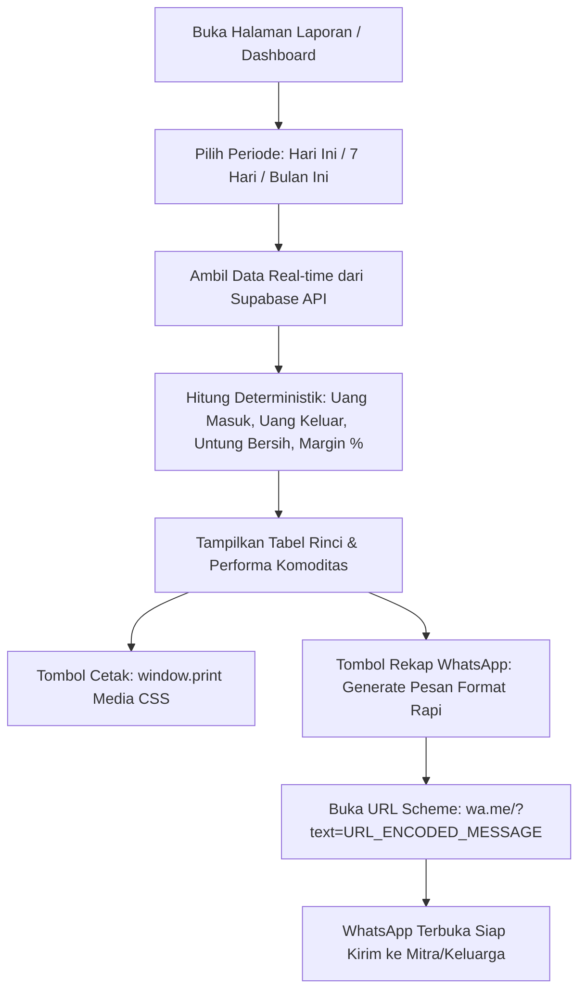

# TECHNICAL_SPEC.md — VokaSync

**Dokumen Spesifikasi Teknis Arsitektur & Implementasi**  
Proyek: VokaSync — AI Business Advisor & Visual Marketing untuk Pedagang Pasar & UMKM Indonesia  
Kompetisi: EXASTI 2.0 — Web Application Competition 2026 (Universitas Negeri Jakarta)  

> **STATUS SISTEM**: ✅ Production Build Sukses — 17+ Next.js routes, 0 TypeScript error, performa tinggi non-blocking dengan database real Supabase.

---

## 1. Tech Stack Aktual & Versi Dependensi

| Komponen | Teknologi | Versi | Peran Teknis & Alasan Pemilihan |
|---|---|---|---|
| **Framework Fullstack** | Next.js App Router | `16.3.4` | SSR, Static Optimization, API Routes server-side aman untuk kunci API |
| **Runtime UI** | React | `19.2.8` | Komponen reaktif, hook `useMemo`, `useState`, `useEffect` |
| **Bahasa Pemrograman** | TypeScript | `^5` | Type-safety menyeluruh pada seluruh model data di `types/index.ts` |
| **Styling & CSS** | Tailwind CSS v4 | `^4` | Atomic CSS responsif modern dengan palet warna emerald gelap profesional |
| **Ikonografi** | Lucide React | `^1.42.0` | Set icon SVG konsisten di antarmuka web dan mobile |
| **Visualisasi Data** | Recharts | `^3.10.1` | BarChart interaktif visualisasi tren pemasukan vs pengeluaran mingguan |
| **Database & Auth** | Supabase PostgreSQL | `@supabase/supabase-js ^2.115.0` | Penyimpanan data relasional dengan RLS (Row-Level Security) aktif |
| **Supabase SSR Helpers** | `@supabase/ssr` | `^0.12.6` | Otentikasi berbasis cookie untuk browser client dan server client |
| **File / Image Storage** | Supabase Storage | Bucket `product-images` | Unggah foto produk & flyer promosi dengan RLS policies publik terisolasi |
| **AI — Parsing Suara** | Google Gemini Flash | Free Tier | Ekstraksi transkrip bahasa alami menjadi JSON transaksi terstruktur |
| **AI — Business Advisor** | Google Gemini Flash | Free Tier | Penyusunan narasi insight ramah awam dengan penjelasan akar masalah (*root-cause*) |
| **AI — Copywriting Promosi** | Google Gemini Flash | Free Tier | Pembuat narasi promosi WhatsApp instan (gaya Pasar, FOMO, Elegan) |
| **AI — Verdict Eksperimen** | Google Gemini Flash | Free Tier | Evaluasi dampak perubahan strategi harga/produk |
| **Voice Recognition** | Web Speech API (`SpeechRecognition`) | Native Browser | Input suara Bahasa Indonesia langsung di browser (Rp0 biaya server audio) |
| **Voice Audio Feedback (TTS)** | Web Speech API (`SpeechSynthesis`) | Native Browser | Asisten berbicara ramah mengonfirmasi transaksi tersimpan |
| **Background Removal** | `@imgly/background-removal` | `^1.7.0` | Pemrosesan segmentasi gambar 100% lokal client-side via WebAssembly (WASM) |
| **Integrasi WhatsApp** | URL Scheme `wa.me` | Browser Native | Pengiriman rekap keuangan dan pesan promosi langsung ke WhatsApp |
| **Deployment & CI/CD** | Vercel | Production | Integrasi otomatis dengan branch GitHub |

---

## 2. Arsitektur Responsif & Navigasi

### 2.1 Breakpoint Antarmuka

| Breakpoint | Ukuran Layar | Mode Navigasi | File Komponen |
|---|---|---|---|
| **Mobile** | $\le 767\text{px}$ | Bottom Navigation 6 Tab (`Beranda`, `Catat`, `Barang`, `Laporan`, `Riwayat`, `Setelan`) | `components/layout/bottom-nav.tsx` |
| **Tablet** | $768\text{px} - 1023\text{px}$ | Sidebar kiri 80px (`w-20`), icon-only mode terpusat | `components/layout/sidebar.tsx` |
| **Desktop** | $\ge 1024\text{px}$ | Sidebar kiri 256px (`w-64`), navigasi lengkap + info toko + profil | `components/layout/sidebar.tsx` |

### 2.2 Shell Global — `components/layout/app-shell.tsx`

Membungkus seluruh antarmuka aplikasi di `app/layout.tsx`:
- Mengelola state sesi pengguna dan sinkronisasi cache profil toko via `sessionStorage` / `localStorage` untuk mencegah loading berulang (*zero-flicker*).
- Menampilkan `<Sidebar />` pada layar desktop/tablet dan menyembunyikannya pada layar mobile.
- Menampilkan `<Header />` adaptif yang menampilkan sapaan nama pemilik, status kios, notifikasi sinyal, dan pintasan transaksi.
- Menampilkan `<BottomNav />` pada layar mobile untuk akses 1-tap jari jempol.

---

## 3. Struktur Folder Proyek Aktual

```
SIMULASI-ANTIGRAVITY/
├── app/
│   ├── (auth)/
│   │   └── login/                          # Halaman login & pendaftaran akun Supabase
│   ├── api/
│   │   ├── experiments/
│   │   │   └── route.ts                    # GET, POST, PATCH eksperimen bisnis
│   │   ├── generate-copy/
│   │   │   └── route.ts                    # POST: Generator copywriting WA via Gemini
│   │   ├── insights/
│   │   │   └── route.ts                    # GET: Metrik deterministik instan + AI insight
│   │   ├── parse-voice/
│   │   │   └── route.ts                    # POST: Smart voice parsing + noise filter
│   │   ├── product-analysis/
│   │   │   └── route.ts                    # GET: Margin, aksi produk, & sisa stok FIFO
│   │   ├── settings/
│   │   │   └── route.ts                    # GET, PATCH: Profil toko, stok fisik, & audio
│   │   ├── transactions/
│   │   │   ├── route.ts                    # GET: List/filter, POST: Simpan + auto-registrasi produk
│   │   │   └── [id]/
│   │   │       └── route.ts                # PATCH: Koreksi item, DELETE: Hapus + cascade
│   │   ├── upload-product-image/
│   │   │   └── route.ts                    # POST: Unggah foto produk ke Supabase Storage
│   │   └── upload-studio-flyer/
│   │       └── route.ts                    # POST: Unggah materi promosi AI studio
│   ├── catat/
│   │   └── page.tsx                        # Form catat suara (TTS audio confirmation) + manual
│   ├── dashboard/
│   │   └── page.tsx                        # Dashboard metrik, share rekap WA, AI advisor
│   ├── eksperimen/
│   │   └── page.tsx                        # Tracking inisiatif perbaikan toko & AI verdict
│   ├── laporan/
│   │   └── page.tsx                        # Laporan laba rugi, cetak rekap, & kirim WA
│   ├── produk/
│   │   └── page.tsx                        # Manajemen barang, upload foto, & pantau stok
│   ├── riwayat/
│   │   └── page.tsx                        # Log transaksi lengkap, filter, pencarian, & edit
│   ├── settings/
│   │   └── page.tsx                        # Pengaturan toko, ambang batas stok, & preferensi
│   ├── globals.css                         # Design tokens palet emerald & CSS variables
│   ├── layout.tsx                          # Root layout Next.js
│   └── page.tsx                            # Root redirect menuju /dashboard
│
├── components/
│   ├── dashboard/
│   │   ├── AdvisorCard.tsx                 # Kartu AI Advisor + tombol Quick-Action WA
│   │   ├── MetricCard.tsx                  # 4 kartu metrik (Uang Masuk, Keluar, Untung, Margin)
│   │   ├── RecentTransactions.tsx          # Tabel ringkas transaksi terbaru
│   │   ├── SignalFeed.tsx                  # Feed kronologis sinyal peringatan bisnis
│   │   └── TrendChart.tsx                  # Visualisasi BarChart Recharts tren 7 hari
│   ├── layout/
│   │   ├── app-shell.tsx                   # Layout shell pembungkus sesi & navigasi
│   │   ├── bottom-nav.tsx                  # Navigasi bawah 6 tab mobile
│   │   ├── header.tsx                      # Header adaptif nama toko & sapaan
│   │   └── sidebar.tsx                     # Sidebar hijau emerald desktop/tablet
│   └── studio/
│       └── StudioModal.tsx                 # Modal AI Virtual Studio (BG removal + frames + WA)
│
├── lib/
│   ├── ai/
│   │   ├── gemini.ts                       # Inisialisasi Google GenAI SDK & handler
│   │   └── prompts.ts                      # Template prompt: parseVoice, dailyAdvisor, copy, verdict
│   ├── calculations/
│   │   └── financial.ts                    # Kalkulasi deterministik margin, status aksi, & FIFO
│   ├── mock-data/
│   │   └── index.ts                        # Fallback data offline saat transisi
│   └── supabase/
│       ├── client.ts                       # createBrowserClient() untuk browser React
│       └── server.ts                       # createServerClient() & createAdminClient()
│
├── supabase/
│   └── schema/
│       ├── 01_profiles.sql                 # Tabel profil & pengaturan toko
│       ├── 02_products.sql                 # Master komoditas/produk
│       ├── 03_transactions.sql             # Header transaksi penjualan & belanja modal
│       ├── 04_transaction_items.sql        # Rincian item produk & harga per transaksi
│       ├── 05_ai_insights.sql              # Riwayat insight & peringatan AI Advisor
│       ├── 06_experiments.sql              # Inisiatif eksperimen bisnis
│       ├── 07_experiment_results.sql       # Checkpoint hasil & evaluasi AI verdict
│       ├── 08_stock_batches.sql            # Inventaris FIFO & sisa kuantitas modal
│       ├── 09_extended_settings.sql        # Migrasi preferensi stok fisik & audio
│       ├── 10_product_images.sql           # Dukungan kolom gambar produk
│       ├── full_schema.sql                 # Skema master 8 tabel + Storage bucket + RLS
│       └── seed_data.sql                   # Data percontohan realistis untuk demo juri
│
├── types/
│   └── index.ts                            # Definisi TypeScript komprehensif seluruh sistem
├── public/
│   └── frames/                             # Bingkai PNG AI Virtual Studio
├── next.config.ts                          # Konfigurasi Next.js (optimasi bundle & images)
└── package.json                            # Manifest dependensi proyek
```

---

## 4. Model Data & Skema Database (Supabase PostgreSQL)

Database dirancang dengan prinsip **Single Source of Truth** untuk seluruh nilai keuangan dan integritas referensial ketat (*Foreign Keys* dengan `CASCADE DELETE`).

### 4.1 Tabel 1: `profiles`
Menyimpan identitas kios/pedagang dan preferensi sistem.
```sql
CREATE TABLE IF NOT EXISTS public.profiles (
  id UUID PRIMARY KEY REFERENCES auth.users(id) ON DELETE CASCADE,
  business_name TEXT DEFAULT 'Kios Dagang Saya',
  owner_name TEXT DEFAULT 'Pedagang',
  business_type TEXT DEFAULT 'Sayur & Buah',
  margin_alert_threshold NUMERIC DEFAULT 20,
  low_stock_threshold NUMERIC DEFAULT 2,          -- Ambang batas stok fisik (kg/pcs)
  supplier_cost_increase_threshold NUMERIC DEFAULT 5, -- Ambang batas kenaikan modal (%)
  sound_alert_enabled BOOLEAN DEFAULT false,      -- Status suara asisten aktif/mati
  sound_alert_volume NUMERIC DEFAULT 80,
  text_size TEXT DEFAULT 'normal',                -- 'kecil' | 'normal' | 'besar' | 'sangat-besar'
  theme TEXT DEFAULT 'terang',                    -- 'terang' | 'gelap'
  default_unit TEXT DEFAULT 'kg',
  analysis_period TEXT DEFAULT '7d',
  app_settings JSONB DEFAULT '{}',
  created_at TIMESTAMPTZ DEFAULT NOW(),
  updated_at TIMESTAMPTZ DEFAULT NOW()
);
```

#### Trigger Registrasi Pengguna Baru (`handle_new_user`)
Secara dinamis mengambil nama dan nama usaha dari metadata pendaftaran tanpa membocorkan data sampel ke akun baru:
```sql
CREATE OR REPLACE FUNCTION public.handle_new_user()
RETURNS TRIGGER AS $$
BEGIN
  INSERT INTO public.profiles (
    id, business_name, owner_name, business_type,
    margin_alert_threshold, low_stock_threshold,
    supplier_cost_increase_threshold, theme, text_size
  )
  VALUES (
    new.id,
    COALESCE(NULLIF(new.raw_user_meta_data->>'business_name', ''), 'Kios Dagang Saya'),
    COALESCE(NULLIF(new.raw_user_meta_data->>'owner_name', ''), split_part(new.email, '@', 1)),
    COALESCE(NULLIF(new.raw_user_meta_data->>'business_type', ''), 'Sayur & Buah'),
    20, 2, 5, 'terang', 'normal'
  )
  ON CONFLICT (id) DO UPDATE SET
    business_name = EXCLUDED.business_name,
    owner_name = EXCLUDED.owner_name,
    business_type = EXCLUDED.business_type;
  RETURN NEW;
END;
$$ LANGUAGE plpgsql SECURITY DEFINER;
```

### 4.2 Tabel 2: `products`
Master data nama komoditas dan referensi foto produk:
```sql
CREATE TABLE IF NOT EXISTS public.products (
  id UUID PRIMARY KEY DEFAULT gen_random_uuid(),
  user_id UUID NOT NULL REFERENCES public.profiles(id) ON DELETE CASCADE,
  name TEXT NOT NULL,
  default_unit TEXT NOT NULL DEFAULT 'kg',
  image_url TEXT DEFAULT NULL,
  created_at TIMESTAMPTZ DEFAULT NOW()
);
```

### 4.3 Tabel 3: `transactions`
Header kejadian transaksi penjualan barang atau belanja modal:
```sql
CREATE TABLE IF NOT EXISTS public.transactions (
  id UUID PRIMARY KEY DEFAULT gen_random_uuid(),
  user_id UUID NOT NULL REFERENCES public.profiles(id) ON DELETE CASCADE,
  type TEXT NOT NULL CHECK (type IN ('expense', 'income')),
  transaction_date TIMESTAMPTZ NOT NULL DEFAULT NOW(),
  source TEXT NOT NULL DEFAULT 'manual' CHECK (source IN ('voice', 'manual')),
  raw_voice_text TEXT,
  created_at TIMESTAMPTZ DEFAULT NOW()
);
```

### 4.4 Tabel 4: `transaction_items`
Rincian per item komoditas yang menjadi **satu-satunya sumber kebenaran angka keuangan**:
```sql
CREATE TABLE IF NOT EXISTS public.transaction_items (
  id UUID PRIMARY KEY DEFAULT gen_random_uuid(),
  transaction_id UUID NOT NULL REFERENCES public.transactions(id) ON DELETE CASCADE,
  product_id UUID NOT NULL REFERENCES public.products(id) ON DELETE CASCADE,
  quantity NUMERIC NOT NULL CHECK (quantity > 0),
  unit TEXT NOT NULL DEFAULT 'kg',
  unit_price NUMERIC NOT NULL CHECK (unit_price >= 0)
);
```

### 4.5 Tabel 5: `stock_batches` (Inventaris FIFO)
Melacak sisa stok fisik dan modal per batch belanja barang:
```sql
CREATE TABLE IF NOT EXISTS public.stock_batches (
  id UUID PRIMARY KEY DEFAULT gen_random_uuid(),
  user_id UUID NOT NULL REFERENCES public.profiles(id) ON DELETE CASCADE,
  product_id UUID NOT NULL REFERENCES public.products(id) ON DELETE CASCADE,
  transaction_id UUID REFERENCES public.transactions(id) ON DELETE SET NULL,
  initial_quantity NUMERIC NOT NULL CHECK (initial_quantity > 0),
  remaining_quantity NUMERIC NOT NULL CHECK (remaining_quantity >= 0),
  cost_price NUMERIC NOT NULL CHECK (cost_price >= 0),
  unit TEXT NOT NULL DEFAULT 'kg',
  status TEXT NOT NULL DEFAULT 'active' CHECK (status IN ('active', 'depleted')),
  created_at TIMESTAMPTZ NOT NULL DEFAULT NOW()
);
```

### 4.6 Tabel 6: `ai_insights`
Log histori narasi dan sinyal peringatan proaktif dari AI Advisor:
```sql
CREATE TABLE IF NOT EXISTS public.ai_insights (
  id UUID PRIMARY KEY DEFAULT gen_random_uuid(),
  user_id UUID NOT NULL REFERENCES public.profiles(id) ON DELETE CASCADE,
  product_id UUID REFERENCES public.products(id) ON DELETE SET NULL,
  severity TEXT NOT NULL CHECK (severity IN ('red', 'yellow', 'green')),
  message TEXT NOT NULL,
  has_quick_action BOOLEAN NOT NULL DEFAULT FALSE,
  metric_snapshot JSONB DEFAULT '{}'::JSONB,
  created_at TIMESTAMPTZ DEFAULT NOW()
);
```

### 4.7 Tabel 7 & 8: `experiments` & `experiment_results`
Tracking inisiatif perbaikan toko dan pencatatan verdict evaluasi AI:
```sql
CREATE TABLE IF NOT EXISTS public.experiments (
  id UUID PRIMARY KEY DEFAULT gen_random_uuid(),
  user_id UUID NOT NULL REFERENCES public.profiles(id) ON DELETE CASCADE,
  product_id UUID REFERENCES public.products(id) ON DELETE SET NULL,
  title TEXT NOT NULL,
  status TEXT NOT NULL DEFAULT 'running' CHECK (status IN ('running', 'completed')),
  baseline_metric JSONB NOT NULL DEFAULT '{}'::JSONB,
  target_metric JSONB DEFAULT '{}'::JSONB,
  started_at TIMESTAMPTZ NOT NULL DEFAULT NOW(),
  target_end_at TIMESTAMPTZ,
  created_at TIMESTAMPTZ DEFAULT NOW()
);

CREATE TABLE IF NOT EXISTS public.experiment_results (
  id UUID PRIMARY KEY DEFAULT gen_random_uuid(),
  experiment_id UUID NOT NULL REFERENCES public.experiments(id) ON DELETE CASCADE,
  recorded_at TIMESTAMPTZ NOT NULL DEFAULT NOW(),
  current_metric JSONB NOT NULL DEFAULT '{}'::JSONB,
  evaluation_status TEXT CHECK (evaluation_status IN ('in_progress', 'success', 'partial', 'failed')),
  ai_verdict_text TEXT,
  created_at TIMESTAMPTZ DEFAULT NOW()
);
```

### 4.8 Supabase Storage Bucket: `product-images`
Bucket publik berkapasitas 5 MB per file khusus menyimpan format gambar `image/jpeg`, `image/png`, `image/webp` dengan izin upload khusus pengguna terotentikasi.

---

## 5. Relasi Antar Tabel (Entity Relationship Diagram)



---

## 6. Alur Sistem Terperinci

### 6.1 Alur Smart Voice Parsing & Auto-Registrasi Komoditas



### 6.2 Alur Laporan Keuangan & 1-Klik Rekap WhatsApp



---

## 7. Daftar Endpoint API Routes

| Endpoint | Method | Autentikasi | Deskripsi & Operasi Database |
|---|---|---|---|
| `/api/parse-voice` | `POST` | Server Key | Menerima transkrip ucapan, menyaring kata pengantar, mengembalikan JSON terstruktur via Gemini Flash |
| `/api/transactions` | `GET` | User Session | Mengambil riwayat transaksi dengan filter tanggal, jenis (`income`/`expense`), dan pencarian |
| `/api/transactions` | `POST` | User Session | Menyimpan header transaksi dan items, serta **mendaftarkan komoditas baru otomatis** jika belum ada |
| `/api/transactions/[id]` | `PATCH` | User Session | Memperbarui item transaksi yang dikoreksi |
| `/api/transactions/[id]` | `DELETE` | User Session | Menghapus transaksi secara permanen beserta seluruh rincian item (`CASCADE DELETE`) |
| `/api/insights` | `GET` | User Session | Menghitung metrik finansial harian, mengidentifikasi komoditas kritis, dan menghasilkan narasi AI Advisor |
| `/api/product-analysis` | `GET` | User Session | Menghitung margin historis 7 hari, volume penjualan harian, status aksi, dan sisa stok fisik FIFO |
| `/api/experiments` | `GET` | User Session | Mengambil daftar inisiatif perbaikan toko beserta checkpoint evaluasi |
| `/api/experiments` | `POST` | User Session | Mendaftarkan eksperimen baru dengan snapshot baseline |
| `/api/experiments` | `PATCH` | User Session + AI | Menyelesaikan eksperimen dan memicu pembuatan verdict evaluasi otomatis oleh Gemini Flash |
| `/api/generate-copy` | `POST` | Server Key | Menghasilkan 3 variasi copywriting promosi WhatsApp (Pasar, FOMO, Elegan) |
| `/api/upload-product-image` | `POST` | Admin Client | Mengunggah foto produk ke bucket Supabase Storage `product-images` dan memperbarui `products.image_url` |
| `/api/upload-studio-flyer` | `POST` | Admin Client | Menyimpan poster flyer promosi hasil AI Virtual Studio |
| `/api/settings` | `GET` | User Session | Mengambil konfigurasi profil toko, ambang batas stok fisik, dan preferensi audio |
| `/api/settings` | `PATCH` | User Session | Menyimpan perubahan data toko, ambang batas peringatan, status suara asisten, dan ukuran teks |

---

## 8. Logika Perhitungan Finansial Deterministik (`lib/calculations/financial.ts`)

Seluruh angka keuangan dihitung secara deterministik di server/klien, **bukan ditebak oleh AI**:

1. **Margin Keuntungan**:
   $$\text{Margin } (\%) = \frac{\text{Harga Jual} - \text{Harga Modal}}{\text{Harga Jual}} \times 100$$
2. **Kategori Aksi Komoditas**:
   - $\text{Margin} \ge 35\% \longrightarrow \textbf{Dorong}$ (Aksen Hijau)
   - $\text{Margin} \ge \text{Threshold } (20\%) \longrightarrow \textbf{Pertahankan}$ (Aksen Biru)
   - $\text{Margin} \ge 10\% \longrightarrow \textbf{Perbaiki}$ (Aksen Kuning)
   - $\text{Margin} < 10\% \longrightarrow \textbf{Kurangi}$ (Aksen Merah)
3. **Penentuan Severity AI Advisor**:
   - $\text{Margin} < \text{Threshold} \longrightarrow \text{Severity: } \textbf{red}, \text{ HasQuickAction: } \textbf{true}$
   - $\text{Margin} < \text{Threshold} + 5 \longrightarrow \text{Severity: } \textbf{yellow}, \text{ HasQuickAction: } \textbf{false}$
   - $\text{Margin} \ge \text{Threshold} + 5 \longrightarrow \text{Severity: } \textbf{green}, \text{ HasQuickAction: } \textbf{false}$
4. **Peringatan Sisa Stok Fisik (kg/pcs)**:
   - Jika sisa kuantitas pada tabel `stock_batches` aktif $\le \text{low\_stock\_threshold}$ (default 2 kg/pcs), pemicu peringatan stok menipis ditampilkan di halaman produk dan kartu sinyal.

---

## 9. Template Pesan 1-Klik WhatsApp

### 9.1 Format Rekap Harian Kios (Dashboard)
```
📊 *Rekap Keuangan Kios*
📅 [Hari, DD MMMM YYYY]

• *Uang Masuk:* Rp[Nominal]
• *Uang Keluar:* Rp[Nominal]
• *Untung Bersih:* Rp[Nominal] ([Margin]%)

_Dicatat otomatis oleh VokaSync — Asisten Keuangan Pedagang Pasar & UMKM._
```

### 9.2 Format Laporan Berkala (Laporan)
```
📊 *Laporan Keuangan Toko*
Periode: [Hari Ini / 7 Hari Terakhir / Bulan Ini / Semua Waktu]

• *Total Uang Masuk:* Rp[Nominal]
• *Total Uang Keluar:* Rp[Nominal]
• *Untung Bersih (Sisa):* Rp[Nominal] ([Margin]%)
• *Jumlah Transaksi:* [Jumlah] catatan

_Dicatat otomatis oleh VokaSync — Asisten Keuangan Pedagang Pasar & UMKM._
```

---

## 10. Konfigurasi Environment & Keamanan Data

### Environment Variables (`.env.local`)
```env
NEXT_PUBLIC_SUPABASE_URL=https://xxxxxxxxxxxxxxxx.supabase.co
NEXT_PUBLIC_SUPABASE_ANON_KEY=eyJhbGciOi...
SUPABASE_SERVICE_ROLE_KEY=eyJhbGciOi...
GEMINI_API_KEY=AIzaSy...
```

### Prinsip Keamanan & Kepatuhan:
1. `GEMINI_API_KEY` dan `SUPABASE_SERVICE_ROLE_KEY` terisolasi ketat di sisi server (API Routes) dan tidak pernah dipaparkan ke bundle client.
2. Row-Level Security (RLS) PostgreSQL aktif pada seluruh tabel: pedagang hanya dapat membaca dan memodifikasi data milik `auth.uid()`.
3. Seluruh foto yang diproses di AI Virtual Studio melalui proses penghapusan background langsung di memori browser pengguna (`@imgly/background-removal` WASM), menjaga kerahasiaan dan menghemat kuota internet pengguna.
